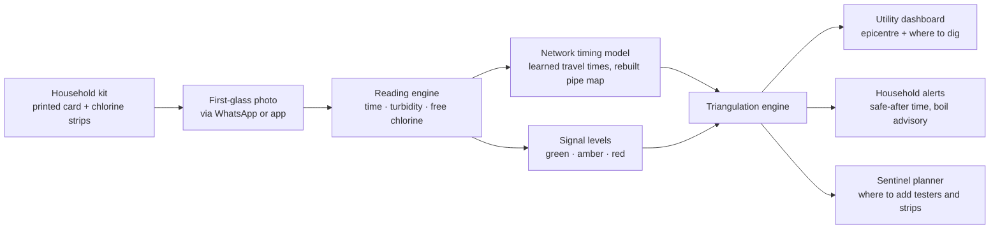

# Upstream — Seismology for Sewage

> Find the sewage leak in a city's water pipes from the timing of the first dirty glass in each home — before it becomes an outbreak.

**Hackathon track:** Heat & Water  ·  **Hardware in the pipes:** none  ·  **Household kit:** a printed card + chlorine test strips  ·  **Status:** working hackathon build (see [BUILD.md](BUILD.md))

### Try it

```bash
pip install -e ".[dev]"
upstream serve        # dashboard at http://127.0.0.1:8000/dashboard/, household page at /report
```

The dashboard replays a simulated Bhagirathpura-style outbreak photo by photo and takes live photos of the printed card. [BUILD.md](BUILD.md) covers the demo, how the locator works, results in simulation, real street grids, card calibration, WhatsApp and the API.

---

## Contents

1. [TL;DR](#1-tldr)
2. [Hackathon fit](#2-hackathon-fit)
3. [The problem](#3-the-problem)
4. [The core insight: seismology for sewage](#4-the-core-insight-seismology-for-sewage)
5. [How it works](#5-how-it-works)
6. [The demo](#6-the-demo)
7. [Build plan](#7-build-plan)
8. [Tech stack](#8-tech-stack)
9. [Repo structure](#9-repo-structure)
10. [Judge questions and answers](#10-judge-questions-and-answers)
11. [Limitations and mitigations](#11-limitations-and-mitigations)
12. [Impact and adoption path](#12-impact-and-adoption-path)
13. [Roadmap](#13-roadmap)
14. [How this idea evolved](#14-how-this-idea-evolved)
15. [Sources](#15-sources)

---

## 1. TL;DR

- In cities where water comes on for an hour or two a day, sewage can leak into empty pipes between supply cycles. When supply switches back on, **the dirtiest water arrives first**, and it reaches each house at a different moment.
- Upstream treats every household's **first glass of water** as a sensor reading. One photo of that glass on a printed card, with a chlorine strip beside it, gives three readings: **exact time, cloudiness (turbidity) and free chlorine**.
- Like seismologists locating an earthquake from when its waves reach different stations, Upstream uses **arrival times** across homes to triangulate the pipe segment where sewage is getting in.
- On normal days, the same photos teach it **how water moves through the network**, so it can rebuild a missing pipe map. On bad days, it tells each home a personal **"safe after" time** and tells the utility **where to dig**.

---

## 2. Hackathon fit

The hackathon brief says that if an idea makes the air cleaner, the water safer or the city lighter, it fits. Upstream sits in the **Heat & Water** track and targets the "water safer" goal directly: it addresses **leaks**, contamination during the **monsoon**, and the everyday reality of intermittent supply.

Most water projects either put IoT sensors in tanks or predict disease from clinic data. Upstream does neither. It uses the **pipe network itself** — and the timing of what flows through it — to find the breach.

---

## 3. The problem

### 3.1 What happened in Indore's Bhagirathpura

Indore is regularly ranked India's cleanest city. In late 2025, sewage got into the drinking-water supply in its Bhagirathpura locality.

| When | What happened |
|---|---|
| Mid-December 2025 | Residents began noticing discoloured, foul-smelling tap water.[^1] |
| Late December 2025 | Deaths and hospitalisations from vomiting and diarrhoea were reported. Residents had been complaining about dirty water for a long time before the administration acted.[^3] |
| Early January 2026 | Media reports put the toll at around 15 deaths with more than 200 people under treatment.[^3] Residents blamed a police-outpost toilet allegedly built without a septic tank above the drinking-water pipeline.[^7] |
| Until 6 February 2026 | Contaminated supply continued, according to the probe commission's records.[^2] |
| 12 February 2026 | The health department had received 35 death reports, 22 of them considered possibly linked to the contaminated water.[^2] |
| Early October 2026 | The probe commission called it the result of decades of systemic failure, pointing to badly placed water and sewer pipelines and leaks.[^2] |

Indore residents receive water **once every two days**.[^3] That detail matters, as the next section explains.

### 3.2 Why it happens: intermittent supply

- **Pipes empty and refill.** In intermittent systems, repeatedly filling and emptying the pipes is considered a primary way pathogens get in: sewage is drawn in at weak spots where pressure drops.[^5] India's public-health engineering manual lists sewer cross-connections, low pressure and dead ends as routes for treated water to be re-contaminated in the network.[^9]
- **The first flush is the dirtiest.** A study in Hubli-Dharwad found that when supply was switched on, water with elevated turbidity and high levels of indicator bacteria was flushed out of the pipes.[^4]
- **Chlorine is not a guarantee.** The same study found indicator bacteria at low pressure even when chlorine residual was present.[^4]
- **First-flush monitoring catches what routine sampling misses.** A study in Arraiján, Panama, showed that monitoring designed for intermittent supply, such as sampling the first flush, can detect threats that conventional monitoring would likely miss.[^13]
- **It varies by network.** In Moamba, Mozambique, the first flush showed no statistically significant effect on microbial quality, contrary to earlier studies.[^8] Any system has to learn each network's normal behaviour.
- **The scale is huge.** Intermittent supply delivers piped water to about a billion people worldwide, and that water is often microbially contaminated.[^6]

### 3.3 The gap

- Complaints are handled **one ticket at a time**. Five complaints from five lanes look like five problems, not one leak.
- Nobody uses **when** the dirty water arrived at each tap, which is the information that locates the breach.
- Utility pipe maps are often **incomplete or outdated**, so even engineers who want to trace a leak struggle.
- Lab sampling is **sparse and slow**: by the time results come back, people are already sick.

---

## 4. The core insight: seismology for sewage

When supply resumes, the slug of contaminated water that collected around a crack is pushed downstream. It reaches nearby downstream homes first and farther homes later, getting more diluted at every junction. Homes upstream of the crack never see it.

That is exactly the structure seismologists use to locate earthquakes.

| Earthquake | Upstream |
|---|---|
| Epicentre | The pipe segment where sewage gets in |
| Seismograph stations | Households photographing their first glass |
| Time the wave arrives | Time the dirty slug reaches each tap |
| Wave strength | Cloudiness and how far chlorine has dropped |
| Velocity model of the Earth | Learned travel times through the pipe network |

**The signal is not whether people complain. It is when the dirty water reached each tap.** A handful of timestamped readings can pinpoint what dozens of separate complaints cannot.

---

## 5. How it works

### 5.1 System overview



### 5.2 The household kit

**The Upstream card** (printed, A5 or smaller):

- Four corner markers (ArUco) so the app can correct angle and distance.
- A black-and-white contrast pattern under a printed circle where the glass sits. The more turbid the water, the more the pattern blurs.
- A **strip slot** with printed colour reference patches beside it, so the app can colour-correct the chlorine strip under any lighting.
- A QR code with the household ID, so no name or phone number needs to travel with the reading.

**Chlorine strip packs.** Every participating home gets free-chlorine test strips in one of three pack sizes:

| Pack | Who gets it | How it is used |
|---|---|---|
| **10 strips** | Regular households | Test when the water looks or smells wrong, once a week as a baseline, and whenever the app asks during an alert. |
| **14 strips** | Lane volunteers | One test per supply for two weeks in daily-supply areas, or four weeks in alternate-day areas like Indore. |
| **21 strips** | Sentinel homes picked by the planner | Daily tests for three weeks, refilled when the planner reassigns sentinel spots. |

Pack sizes are the team's starting proposal and should be tuned during a pilot.

**Why chlorine strips matter:** water can look perfectly clear and still be contaminated. When sewage gets in, it uses up the chlorine in the water, so a drop in chlorine is a chemical warning sign even when the glass looks clean. Indian drinking-water standard IS 10500 requires at least **0.2 mg/L free residual chlorine** at the consumer end.[^12][^9]

### 5.3 The first-glass protocol

1. When water comes on, fill a clear glass with the **first** water from the tap.
2. Place the glass on the card's circle. Dip one chlorine strip in the water as its instructions say, then lay it in the strip slot.
3. Take **one photo** of the card with the glass and strip on it, and send it through the app or WhatsApp.
4. Optionally tap one quick answer: *smells bad · looks dirty · someone is ill · fine*.

**One photo, three readings:** the time, the cloudiness and the chlorine level. "Fine" answers matter as much as complaints, because they rule pipes out.

### 5.4 Reading engine

| Reading | How it is measured | What the research says | How Upstream uses it |
|---|---|---|---|
| **Time** | Photo metadata and message timestamp, compared with the supply start time | — | Arrival time of water, or of the dirty slug, at that tap |
| **Turbidity** | Blur and contrast loss of the printed pattern seen through the water, calibrated against reference samples | A phone-camera app with no extra equipment sorted water into eight turbidity bands from 0 to 40 NTU, with 91–99% accuracy on lab samples.[^10] | Detects **spikes** relative to that tap's normal level. It is not used to certify water as meeting the 1 NTU standard.[^12] |
| **Free chlorine** | Strip colour compared with the printed reference patches after colour correction | Embedding colour references in a printed code let phones read free-chlorine strips with about 88% accuracy in real-world lighting.[^11] | Flags taps below the 0.2 mg/L minimum, and sharp drops relative to that tap's normal level |
| **Self-report** | One tap: smell, colour, illness or fine | — | Extra evidence, and "fine" rules out pipes |

**Photo checks:** reject blurry or glare-heavy photos and ask for a retake; flag re-used photos using perceptual hashing.

### 5.5 Signal levels

Every tap gets its own baseline, because water behaves differently across and within networks.[^8]

| Level | Condition | What happens |
|---|---|---|
| 🟢 **Green** | Chlorine at or above 0.2 mg/L and turbidity normal for that tap | Logged as baseline; timing feeds the network model |
| 🟡 **Amber** | Chlorine below 0.2 mg/L, **or** turbidity above that tap's normal level | The app asks 3–5 nearby homes with strips to test at the next supply, so strips are spent where they add the most information |
| 🔴 **Red** | Chlorine near zero plus a turbidity spike, **or** a cluster of smell, colour or illness reports | Triangulation runs, the utility is alerted, and downstream homes get safe-after times |

### 5.6 Network timing model and pipe-map rebuilding

On normal days, every first-glass photo records **when water reached that tap** after supply started. The order in which water arrives traces the pipes beneath the streets.

- **If the utility has a GIS pipe map**, Upstream uses it and only calibrates travel times from the photos.
- **If it doesn't**, Upstream rebuilds a likely pipe tree over the street grid from OpenStreetMap.

```python
# taps: reporting homes with their typical delay after supply starts
network = {inlet}
for tap in sorted(taps, key=lambda t: t.typical_delay):
    # join each tap to the network along streets,
    # preferring joins that keep delays increasing downstream
    path = cheapest_street_path(tap, network,
                                cost=distance + LAMBDA * delay_violation)
    network |= path
travel_time_model = fit_travel_times(network, observed_delays)
```

Normal days teach Upstream the timing; bad days use that timing to triangulate.

### 5.7 Triangulation engine

Every pipe segment, split into roughly 20-metre pieces, is a candidate breach. For each candidate, the model predicts when the dirty slug would reach each reporting tap and how diluted it would be, then scores how well that matches what was actually reported.

```python
for c in candidates:                      # ~20 m pipe pieces
    log_l = 0.0
    for r in reports_this_cycle:
        t_pred, dilution = model.arrival(c, r.tap, supply_start)
        if t_pred is None:                # tap is not downstream of c
            log_l += loglik_clean(r)      # a dirty reading here counts against c
        else:
            log_l += loglik_timing(r.t_obs - t_pred, sigma=model.noise(r.tap))
            log_l += loglik_signal(r.turbidity, r.chlorine, dilution, baseline[r.tap])
    posterior[c] = prior[c] * exp(log_l)  # prior comes from the risk map
normalise(posterior)
epicentre = argmax(posterior)
ring = credible_region(posterior, 0.9)   # uncertainty ring shrinks with each photo
```

**Plan B (pure graph rule):** if hydraulic modelling is too slow to build, the breach must sit upstream of every red tap and not upstream of any green tap. Intersecting those sets on the pipe tree still narrows the search sharply.

If time allows, **WNTR** (a free Python toolkit for simulating water networks) can replace the simple travel-time model with a hydraulic simulation that switches supply on and off on a schedule.

### 5.8 Outputs

| For | Output |
|---|---|
| **Water department** | Breach epicentre on a map, confidence, suggested dig spot, and the evidence behind it (photos, timings, chlorine readings) |
| **Households downstream** | A personal **safe-after time** — for example, "Today, fill drinking water after 7:14 am; use the first fill for cleaning" — plus a boil-water advisory. Upstream homes are not alarmed. |
| **Sentinel planner** | Which lane would shrink the uncertainty most if one more home joined or got a strip pack |
| **Risk map** | Spots where water mains cross sewers, ranked by pipe age, supply gaps and past incidents, for pre-monsoon inspection |

The safe-after time comes straight from the model: it knows when the slug reaches each tap and how long it takes to pass.

---

## 6. The demo

**Two moments that win it:**

1. **Live glass test.** A judge stirs a spoon of mud into a glass on the card and dips a strip. The phone reads cloudiness and chlorine on the spot.
2. **The epicentre map.** Replay a Bhagirathpura-style outbreak on **Indore's real street grid** from OpenStreetMap. Timestamped photos arrive, and the uncertainty ring tightens onto one stretch of pipe. Then flip to the rebuilt pipe network and each home's safe-after time.

**Headline number:** how many days earlier Upstream finds the crack than handling complaints one ticket at a time, and how close it gets (in metres) to the true breach in the simulation.

**Three-minute pitch outline:**

| Time | Beat |
|---|---|
| 0:00–0:30 | Indore: India's cleanest city, months of complaints, dozens of deaths |
| 0:30–1:00 | The insight: the dirtiest water arrives first — seismology for sewage |
| 1:00–1:40 | Live glass and strip test |
| 1:40–2:30 | Epicentre map, rebuilt network, safe-after messages |
| 2:30–3:00 | Impact, cost and pilot ask |

---

## 7. Build plan

### Hackathon MVP vs stretch

| Hackathon MVP | Stretch, if time allows |
|---|---|
| Printable card with ArUco markers, contrast pattern and colour patches | Small CNN turbidity model trained on your own calibration photos |
| OpenCV reader for turbidity and chlorine strips | Live WhatsApp bot instead of a web form |
| Simulated pipe network on a real street grid | WNTR hydraulic simulation with on/off supply |
| Scripted outbreak with timed reports | Pipe-map rebuilding from arrival times, scored against the true network |
| Triangulation with live map and uncertainty ring | Sentinel planner and risk map |
| Safe-after messages for downstream homes | Utility dashboard with evidence export |

### Suggested team split (4 people)

| Person | Owns |
|---|---|
| 1 | Card design and the OpenCV reader (turbidity + chlorine) |
| 2 | Street-grid simulator and triangulation engine |
| 3 | Intake (web form or WhatsApp) and the Leaflet dashboard |
| 4 | Calibration samples, pitch, story and research |

### 24-hour timeline (scale to your hackathon length)

| Hours | Goal |
|---|---|
| 0–3 | Print the card; make calibration samples (clear, light mud, heavy mud; tap water with and without chlorine); load the street grid |
| 3–10 | Reader working on real photos; simulator generating outbreaks; first triangulation run |
| 10–16 | Connect intake → reader → locator → map |
| 16–21 | Safe-after messages, polish the map animation, stretch goals if ahead |
| 21–24 | Rehearse the demo, record a backup video, finalise slides |

---

## 8. Tech stack

| Layer | Tools |
|---|---|
| Card | SVG or PDF with OpenCV ArUco markers, colour reference patches, QR household ID |
| Reading | Python, OpenCV, NumPy; optional small CNN in PyTorch |
| Intake | WhatsApp Cloud API, or a simple web form / PWA for the demo |
| Network | OSMnx and NetworkX; WNTR for hydraulics if time allows |
| Locator | NumPy / SciPy Bayesian scoring |
| Backend and storage | FastAPI, SQLite or Postgres |
| Dashboard | Leaflet (or deck.gl) |

---

## 9. Repo structure

The proposed layout below is now built as one Python package, `upstream/` (see [BUILD.md](BUILD.md)):

```
upstream/
├── card/        # printable card: one spec for the SVG, the raster render and the reader
├── reader/      # OpenCV turbidity and chlorine-strip reading, photo checks, calibration
├── sim/         # street grids (synthetic or OpenStreetMap), pipe layout, households, outbreaks
├── locate/      # baselines, levels, travel times, triangulation, Plan B, map rebuilding,
│                #   safe-after advisories, sentinel planner
├── intake/      # FastAPI app, SQLite store, household photo page, WhatsApp webhook
├── dashboard/   # Leaflet map UI: outbreak replay, live intake, household card
├── network.py   # first-arrival flow tree over a (possibly looped) pipe network
├── physics.py   # how the dirty slug dilutes and spreads downstream
└── scenario.py  # the end-to-end replay: normal days -> outbreak -> alerts -> dig spot
data/            # synthetic scenario replay and evaluation results (no personal data)
tests/           # pytest suite
```

---

## 10. Judge questions and answers

| They'll ask | You say |
|---|---|
| "Utilities won't share pipe maps." | Upstream can rebuild a likely pipe map from arrival times. In a pilot, the utility uses its own GIS, which it already owns. |
| "Complaints are noisy, or pranks." | Scoring is probabilistic, so a few false reports barely move it. Photos and chlorine readings are evidence, not opinions, and re-used photos are flagged. |
| "Flow direction flips when supply switches on and off." | The model is built around the on/off schedule and learns real timings from normal days. |
| "Will people really test every day?" | They don't need to. Roughly one tester per lane is enough, sentinel homes get the larger strip packs, and the planner places testers where they add the most. Volunteers can come from resident associations, health workers or school science clubs. |
| "Clear water can still be unsafe." | That's why every kit has chlorine strips. Upstream is an early-warning and leak-finding tool, not a safety certificate; red alerts still go to lab confirmation. |
| "How accurate is a phone camera?" | Published studies show phone-only turbidity readings and phone-read chlorine strips both work reasonably well.[^10][^11] Upstream watches for changes against each tap's own baseline, which is easier than absolute measurement. |
| "Why not IoT sensors in the pipes?" | They cost money to install and maintain at every node. Upstream needs no hardware in the pipes, and can still use sensor data wherever it exists. |
| "What about privacy?" | Readings carry a household ID from the card, location is kept at lane level, and data is used only for water safety. |

---

## 11. Limitations and mitigations

| Limitation | Mitigation |
|---|---|
| Turbidity does not equal bacteria; clear water can be contaminated | Chlorine strips in every kit; red alerts trigger lab tests |
| Chlorine residual does not guarantee safety — bacteria have been found even with chlorine present at low pressure[^4] | Combine chlorine, turbidity, timing and reports; never present a green reading as "certified safe" |
| Phone readings are less precise than lab instruments | Detect changes against each tap's own baseline, not absolute limits; calibrate the card per batch |
| The first-flush effect varies between networks[^8] | Learn each network's normal pattern before raising alerts |
| Participation may drop off | Small strip packs, a one-photo routine, sentinel planning, and feedback to residents ("your reading helped locate a leak") |
| Travel times shift with demand and supply hours | Keep re-learning timings from normal-day photos |
| Strip supply and cost | Spend strips where the planner says they add the most information; refill sentinels first |

---

## 12. Impact and adoption path

**Who uses it:** municipal water departments and jal boards, ward engineers, district health teams, and resident associations.

**Pilot design:** one ward with intermittent supply, around 50 volunteer homes, a few sentinel homes with 21-strip packs, and one month of baseline before alerts go live.

**What to measure:**

- **Lead time:** days between the first red signal and when the breach would otherwise have been found
- **Localisation error:** distance between the predicted epicentre and the actual repair point
- **False alarm rate**
- **Strips used per confirmed incident**
- **Participation:** share of sentinel and volunteer homes reporting each supply cycle

**Why it scales:** intermittent supply is common across Indian cities and serves around a billion people worldwide.[^6] Upstream needs a printed card, chlorine strips and a phone — no trenching, no sensors.

---

## 13. Roadmap

| Stage | Milestone |
|---|---|
| Hackathon | Working reader, simulator, triangulation and demo on Indore's street grid |
| Field test | Calibrate the card and strips on real tap water across lighting conditions |
| Ward pilot | 50 homes, one month of baseline, live alerts with a partner water department |
| City rollout | Utility GIS integration, risk map for pre-monsoon inspection, health-department link |

---

## 14. How this idea evolved

- **v1 — complaints as sensors.** A WhatsApp bot asked "How's your water today?" (smell, colour, illness or fine). A breach locator scored pipe segments against reports, a risk map ranked water-sewer crossings, and boil-water alerts went only to downstream homes.
- **v2 — seismology for sewage.** The first-glass photo became the sensor. Arrival-time triangulation replaced complaint counting, normal-day timings rebuilt the pipe map, and every home got a personal safe-after time.
- **v2.1 — chlorine strip packs (team input).** Households receive packs of 10, 14 or 21 chlorine strips. They upload a photo of the strip after testing through the app or WhatsApp, so Upstream can catch contamination that looks clear and judge each reading on chemistry, not just appearance.

---

## 15. Sources

Facts in this document are paraphrased from the sources below. Check the originals before quoting a figure.

[^1]: *2025 Indore drinking water contamination.* Wikipedia. https://en.wikipedia.org/wiki/2025_Indore_drinking_water_contamination

[^2]: *Contaminated water in Indore's Bhagirathpura result of decades of systemic failure: Probe commission.* PTI via inkl, October 2026. https://www.inkl.com/news/contaminated-water-in-indores-bhagirathpura-result-of-decades-of-systemic-failure-probe-commission

[^3]: *Contaminated drinking water case: CAG report found serious flaws, but Indore remained unconcerned.* Down To Earth, January 2026. https://www.downtoearth.org.in/water/contaminated-drinking-water-case-cag-report-found-serious-flaws-but-indore-remained-unconcerned

[^4]: Kumpel, E. and Nelson, K. L. *Mechanisms Affecting Water Quality in an Intermittent Piped Water Supply.* Environmental Science & Technology, 2014 (Hubli-Dharwad study). https://pubs.acs.org/esthag/article-abstract/48/5/2766/1481708/Mechanisms-Affecting-Water-Quality-in-an?redirectedFrom=fulltext

[^5]: *Intermittent water supply interventions for India's cities.* The Source. https://thesourcemagazine.org/?p=8915

[^6]: *Analytical scaling relations to evaluate leakage and intrusion in intermittent water supply systems.* MIT DSpace. https://dspace.mit.edu/handle/1721.1/117549

[^7]: *Indore water horror: Police outpost toilet without septic tank linked to 10 deaths.* Gulf News, January 2026. https://gulfnews.com/world/asia/india/indore-water-horror-police-outpost-toilet-withoutseptic-tank-linked-to-10-deaths-1.500398092

[^8]: *Effect of operational strategies on microbial water quality in small scale intermittent water supply systems: The case of Moamba, Mozambique.* ScienceDirect. https://www.sciencedirect.com/science/article/pii/S1438463921001097

[^9]: CPHEEO Manual on Water Supply, Chapter 4 — summary by Infralens (re-contamination routes, residual chlorine at consumer end, monitoring parameters). https://infralens.in/cpheeo/cpheeo-ws-04

[^10]: Jantarakasem, C., Sioné, L. and Templeton, M. R. *Estimating drinking water turbidity using images collected by smartphone camera.* Aqua, 2024. https://spiral.imperial.ac.uk/entities/publication/26134c4f-fedd-4a93-a0a0-316735e18f1c

[^11]: González-Gómez, M. et al. *Color QR Codes for Smartphone-Based Analysis of Free Chlorine in Drinking Water.* Sensors (MDPI), May 2025. https://hdl.handle.net/2445/221298

[^12]: *Uniform Drinking Water Quality Monitoring Protocol, Annexure II — IS 10500:2012 limits.* Public Health Engineering Department, Assam. https://phewater.assam.gov.in/sites/default/files/swf_utility_folder/departments/water_medhassu_in_oid_5/menu/document/Water%20Quality%20Standards.pdf

[^13]: Water quality in intermittent and continuous supply zones of Arraiján, Panama — study summary on science.gov. https://www.science.gov/topicpages/q/quality+water+supply
